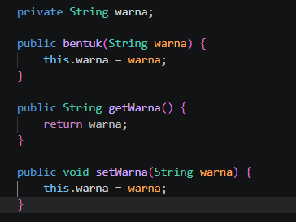
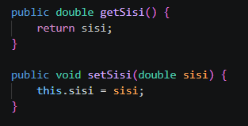
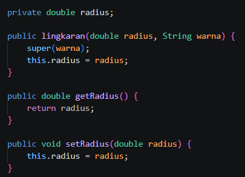
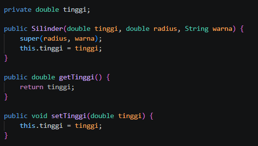
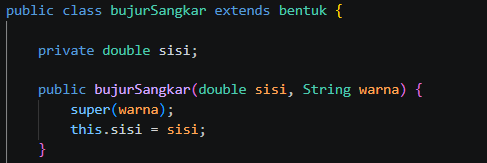
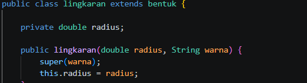
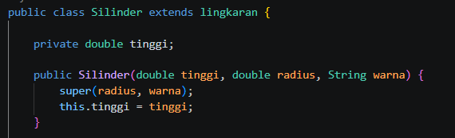
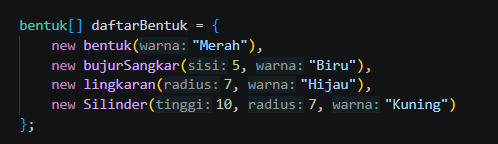
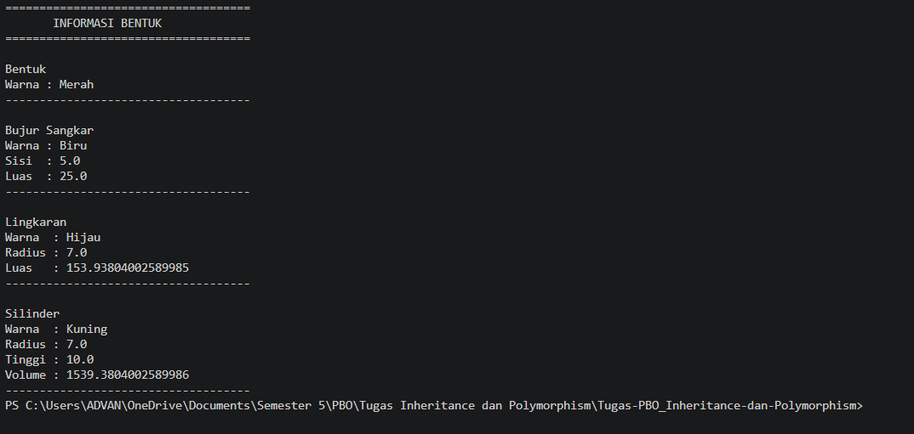

# Exercise Inheritance, Encapsulation, and Polymorphism

Program ini dibuat untuk menerapkan konsep dasar Object-Oriented Programming (OOP), yaitu **Encapsulation, Inheritance, dan Polymorphism** menggunakan bahasa pemrograman Java.

## Class yang Digunakan

Program terdiri dari beberapa class:

- `Bentuk` → sebagai parent class
- `BujurSangkar` → turunan dari `Bentuk`
- `Lingkaran` → turunan dari `Bentuk`
- `Silinder` → turunan dari `Lingkaran`
- `Main` → digunakan untuk membuat objek dan menjalankan program

1. Encapsulation

    Encapsulation diterapkan dengan menggunakan private pada atribut dan getter/setter untuk mengakses atau mengubah nilai atribut.
    Contoh pada Bentuk.java:

    

    Contoh pada BujurSangkar.java:

   

    Contoh pada Lingkaran.java:

   

    Contoh pada Silinder.java:

    

2. Inheritance

    Inheritance diterapkan menggunakan keyword extends. Class turunan dapat menggunakan atribut dan method yang berasal dari class parent.

    Contoh pada BujurSangkar.java:

   

    Contoh pada Lingkaran.java:

    

    Contoh pada Silinder.java:

   

    Pada Silinder, terjadi multilevel inheritance karena Silinder mewarisi Lingkaran, sedangkan Lingkaran sendiri mewarisi Bentuk.

3. Polymorphism

    Polymorphism diterapkan dengan menggunakan tipe parent class Bentuk untuk menyimpan objek dari class turunannya.

    Contoh pada Main.java:
    

OUTPUT : 

