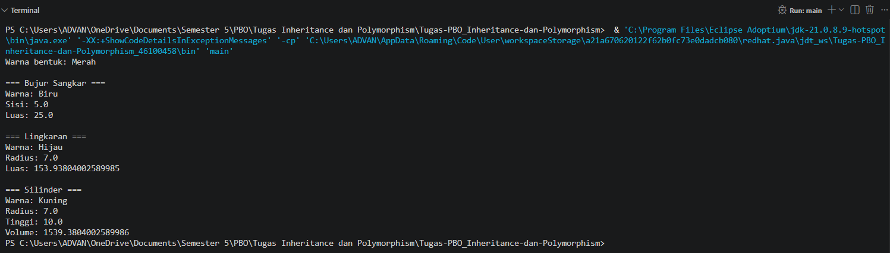

# Tugas-PBO_Inheritance-dan-Polymorphism

Program Java sederhana untuk menerapkan konsep **Inheritance** dan **Polymorphism**.

## Class yang Digunakan

- `Bentuk` → parent class
- `BujurSangkar` → turunan dari `Bentuk`
- `Lingkaran` → turunan dari `Bentuk`
- `Silinder` → turunan dari `Lingkaran`
- `Main` → menjalankan dan menguji program

## Penerapan Inheritance

Inheritance diterapkan menggunakan keyword `extends`.

```java
public class BujurSangkar extends Bentuk
public class Lingkaran extends Bentuk
public class Silinder extends Lingkaran

## Penerapan Polymorphism

Polymorphism diterapkan dengan menggunakan referensi dari parent class
`Bentuk` untuk menyimpan objek dari class turunannya.

Contohnya pada `Main.java`:

```java
Bentuk bujur = new BujurSangkar(5, "Biru");
Bentuk lingkar = new Lingkaran(7, "Hijau");
Bentuk silinder = new Silinder(10, 7, "Kuning");

# Output Program
